# City Pulse (React Native)

Small RN app showcasing **Ticketmaster search**, **event details + map pin**, **favorites (MMKV/Zustand)**, **mock auth**, and **i18n (EN/AR with RTL toggle + restart)**.

## Features

- Search by **keyword/city** with **infinite scroll**
- Event details: header image, date/venue/price/categories, **share**, **favorite (heart)**, **open Ticketmaster**, **map pin**
- **Favorites** persisted in **MMKV** (via Zustand)
- **Auth (mock)**: login / signup / logout
- **i18n**: default **English**, toggle **EN/AR** (RTL + restart)
- **Profile**: user data + language toggle + logout

**Stack:** React Native + TypeScript, React Navigation, Axios + React Query, Zustand + MMKV, i18next, react-native-maps, react-native-vector-icons.

---

## Setup

```bash
yarn install
# iOS only
npx pod-install
 or cd ios
  pod install
```

Create **.env** at project root:

```env
BASE_URL=https://app.ticketmaster.com/discovery/v2
TM_API_KEY=YOUR_TICKETMASTER_KEY
```

> Get a free Ticketmaster key from their developer portal and paste it as `TM_API_KEY`.

### Maps

- **iOS:** Apple Maps works by default (no key required).
- **Android (Google Maps):** add your key inside `android/app/src/main/AndroidManifest.xml`:

```xml
<meta-data
  android:name="com.google.android.geo.API_KEY"
  android:value="YOUR_GOOGLE_MAPS_KEY"/>
```

---

## Run

```bash
npx react-native start
npx react-native run-ios      # or
npx react-native run-android
```

**Mock login:** `test@demo.com` / `123456` (or sign up any account).

---

## How to Use

- **Search:** enter keyword/city → results → tap a card for details
- **Favorite:** tap the **heart** on details (saved via MMKV)
- **Map:** details show a venue pin if lat/lng exist
- **Language:** Profile → globe toggle (EN/AR). App restarts & flips to RTL in AR
- **Logout:** Profile → Log out

---

## Code Map

- Search (infinite): `src/hooks/useSearchEventsInfinite.ts`
- Details: `src/screens/EventDetails/EventDetailsScreen.tsx`
- Map: `src/components/common/EventMap.tsx`
- Store (MMKV/Zustand): `src/store/*` (`favorites` in state)
- i18n: `src/translations/*` (`initLang`, `changeLng`, `LanguageIconToggle`)
- API helper: `src/utils/apiHelpers.ts`

---

## Screenshots

> iOS (left) • Android (right)

### 1- Login

<table>
  <tr>
    <td>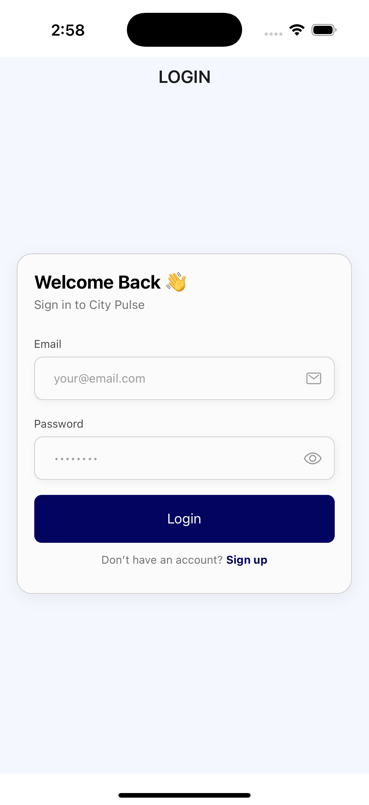</td>
    <td>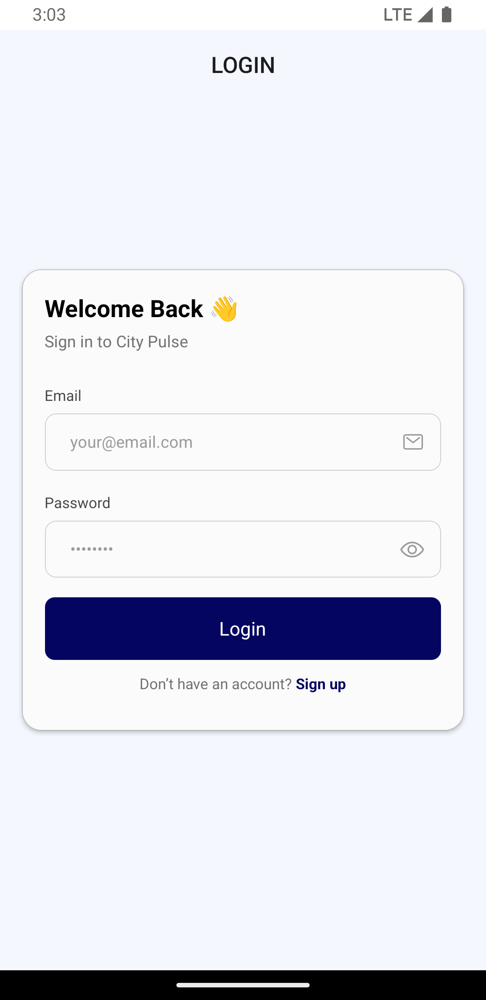</td>
  </tr>
</table>

### 2- Signup

<table>
  <tr>
    <td>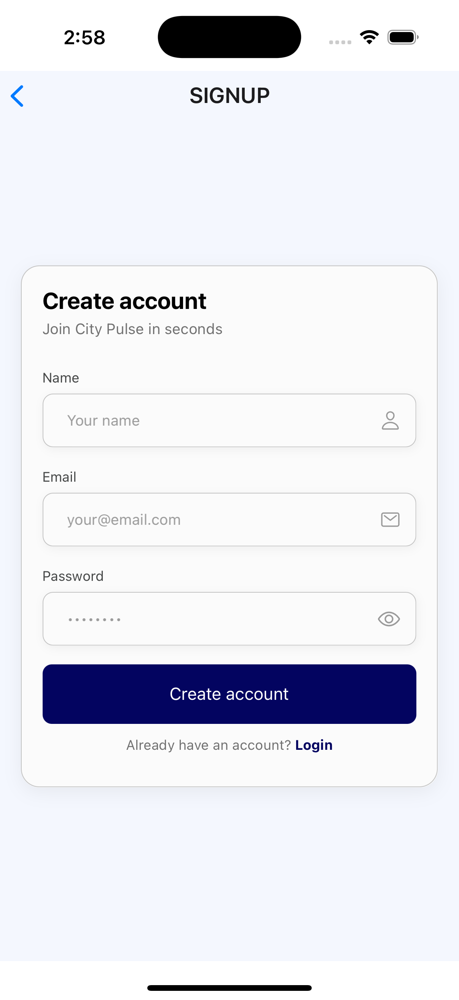</td>
    <td>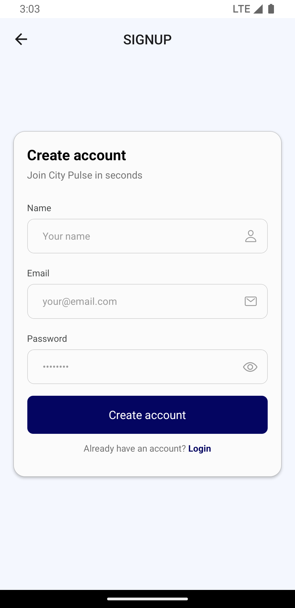</td>
  </tr>
</table>

### 3- Home (empty state)

<table>
  <tr>
    <td>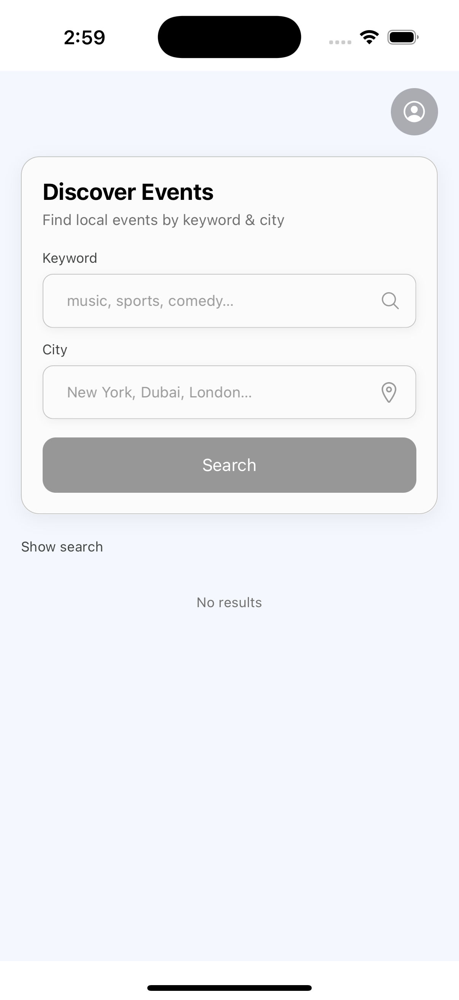</td>
    <td>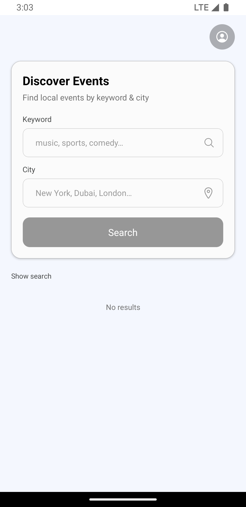</td>
  </tr>
</table>

### 4- Home (results)

<table>
  <tr>
    <td>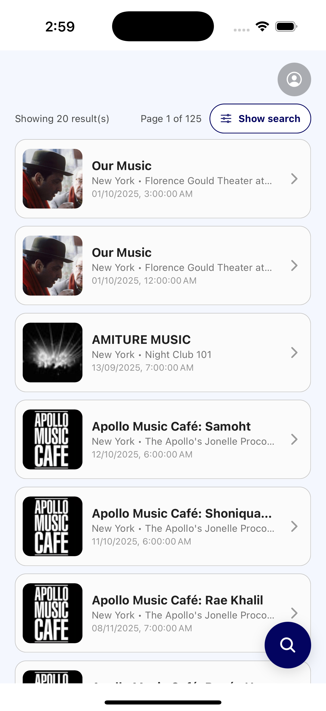</td>
    <td>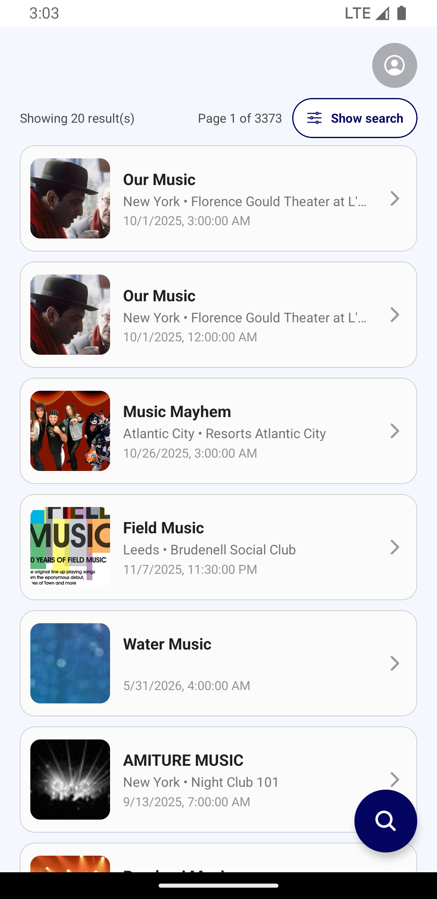</td>
  </tr>
</table>

### 5- Event details

<table>
  <tr>
    <td>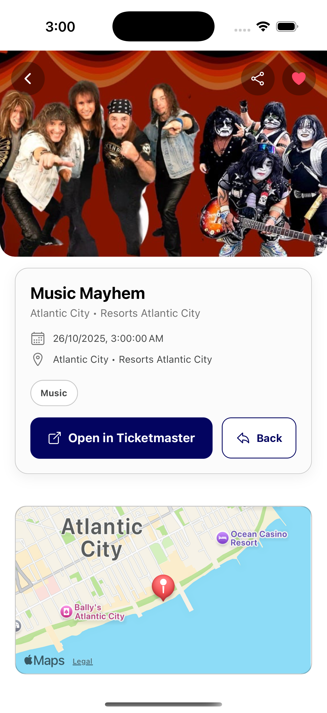</td>
    <td>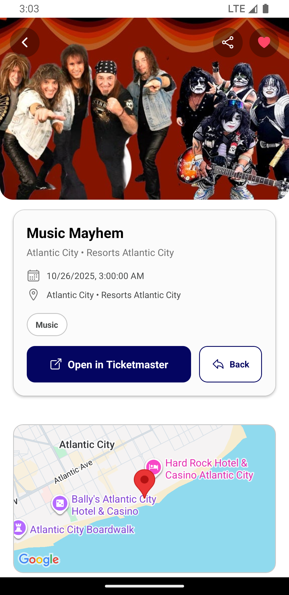</td>
  </tr>
</table>

### 6- Profile

<table>
  <tr>
    <td>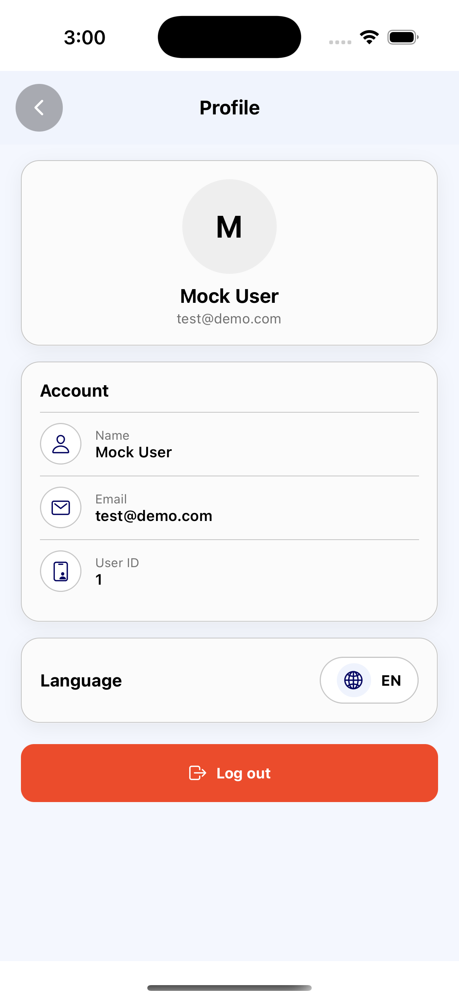</td>
    <td>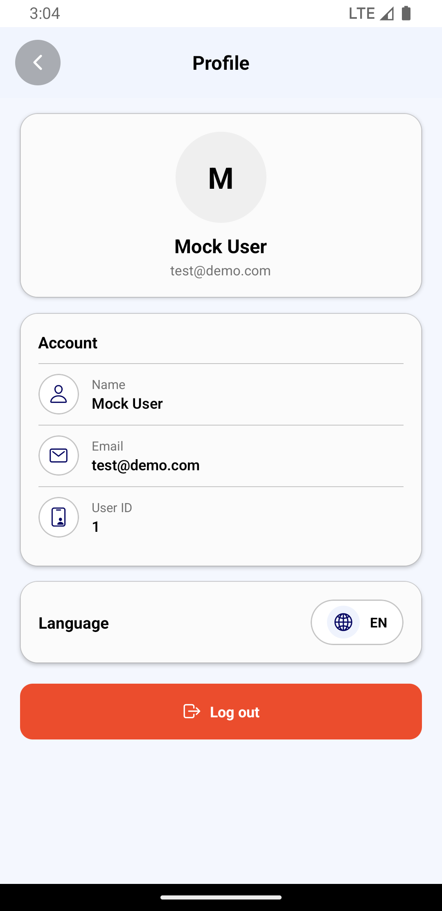</td>
  </tr>
</table>

### 7- Arabic / RTL

<table>
  <tr>
    <td>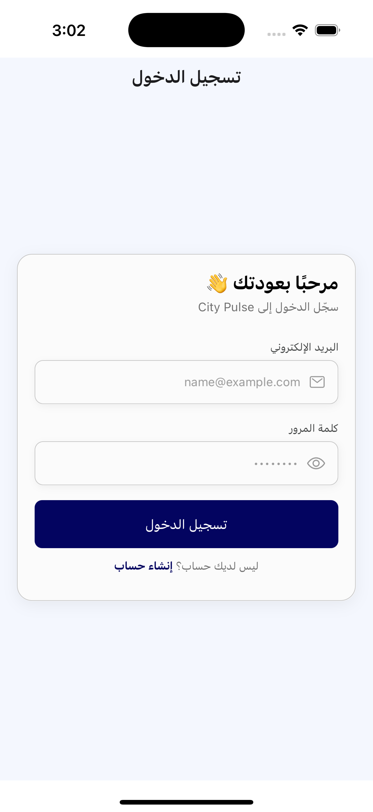</td>
    <td>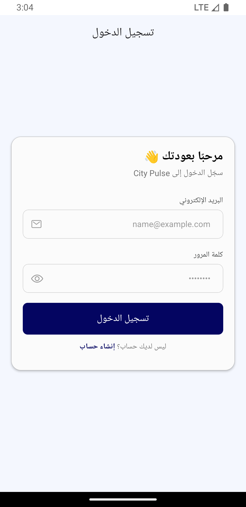</td>
  </tr>
</table>
